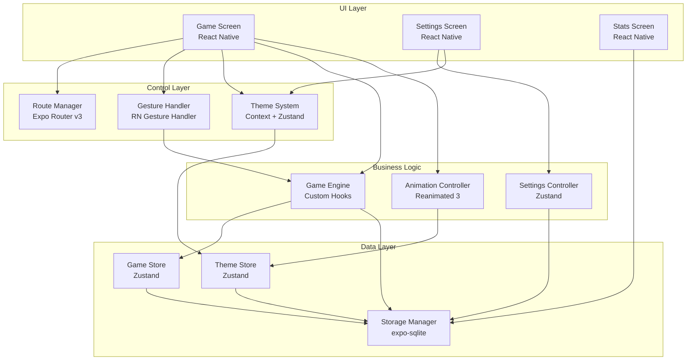

# Components

## Game Engine Component

**Responsibility:** Core 2048 game logic including board state management, move validation, tile spawning, merge detection, and win/lose condition evaluation.

**Key Interfaces:**

- `makeMove(direction: Direction): MoveResult` - Execute player moves with validation
- `initializeGame(): GameState` - Create new game with initial board state
- `canMove(): boolean` - Check if any valid moves remain
- `calculateScore(mergedTiles: Tile[]): number` - Compute score from merged tiles
- `spawnRandomTile(): Tile` - Generate new tiles at random positions

**Dependencies:** GameState and Tile data models, random number utilities

**Technology Stack:** TypeScript custom hooks with pure functions for game logic, Zustand integration for state updates, expo-sqlite for persistence

## Animation Controller Component

**Responsibility:** Orchestrates all visual animations including tile movements, merges, spawning effects, and UI transitions using React Native Reanimated 3.

**Key Interfaces:**

- `animateTileMovement(from: Position, to: Position): Promise<void>` - Smooth tile sliding animations
- `animateTileMerge(tiles: Tile[]): Promise<void>` - Merge effect with scaling and opacity
- `animateNewTile(tile: Tile): Promise<void>` - Tile spawn animation with bounce effect
- `animateScoreUpdate(newScore: number): Promise<void>` - Score counter animation
- `setAnimationSpeed(speed: AnimationSpeed): void` - Adjust animation timing

**Dependencies:** Reanimated 3 shared values, GameState for animation triggers, Theme system for colors

**Technology Stack:** React Native Reanimated 3 with native driver, custom animation hooks, TypeScript interfaces for animation configs

## Gesture Handler Component

**Responsibility:** Captures and interprets user input including swipe gestures, touch events, and keyboard inputs across mobile and web platforms.

**Key Interfaces:**

- `onSwipeGesture(direction: Direction): void` - Process directional swipe inputs
- `onKeyPress(key: string): void` - Handle keyboard arrow keys for web
- `configureGestures(settings: GestureConfig): void` - Customize gesture sensitivity
- `enableHapticFeedback(enabled: boolean): void` - Control haptic responses (mobile only)

**Dependencies:** React Native Gesture Handler, Game Engine for move execution, UserPreferences for haptic settings

**Technology Stack:** React Native Gesture Handler v2.18+, Expo Haptics for feedback, custom gesture recognition hooks

## Theme System Component

**Responsibility:** Manages application-wide theming including color schemes, tile appearances, and visual styles with support for multiple themes.

**Key Interfaces:**

- `getCurrentTheme(): ThemeColors` - Get active theme configuration
- `setTheme(theme: ThemeType): void` - Switch between available themes
- `getTileColor(value: number): string` - Get color for specific tile values
- `getAnimationConfig(): AnimationConfig` - Theme-specific animation settings

**Dependencies:** UserPreferences for theme persistence, Zustand for theme state

**Technology Stack:** React Context API with Zustand backing store, TypeScript theme definitions, React Native StyleSheet

## Storage Manager Component

**Responsibility:** Handles all data persistence operations including game state saving, statistics tracking, and user preferences using expo-sqlite.

**Key Interfaces:**

- `saveGameState(state: GameState): Promise<void>` - Persist current game progress
- `loadGameState(): Promise<GameState | null>` - Restore saved game
- `updateStatistics(stats: GameStatistics): Promise<void>` - Track long-term statistics
- `saveUserPreferences(prefs: UserPreferences): Promise<void>` - Store user settings
- `clearAllData(): Promise<void>` - Reset all stored data

**Dependencies:** expo-sqlite for database operations, data models for type safety

**Technology Stack:** expo-sqlite v18.1+, TypeScript database interfaces, transaction management for data integrity

## Route Manager Component

**Responsibility:** Manages application navigation and deep linking using Expo Router v3 with type-safe routing and automatic route generation.

**Key Interfaces:**

- `navigateToScreen(route: AppRoute): void` - Type-safe navigation between screens
- `handleDeepLink(url: string): void` - Process incoming deep links
- `getCurrentRoute(): string` - Get active route information
- `canGoBack(): boolean` - Check navigation history availability

**Dependencies:** Expo Router v3, TypeScript route definitions

**Technology Stack:** Expo Router v3.5+ with file-based routing, automatically generated typed routes, React Navigation v6 under the hood

## Settings Controller Component

**Responsibility:** Manages user preferences, settings persistence, and configuration options including themes, haptics, and gameplay preferences.

**Key Interfaces:**

- `updatePreference<T>(key: keyof UserPreferences, value: T): void` - Update specific settings
- `resetToDefaults(): void` - Restore default settings
- `exportSettings(): string` - Generate settings backup
- `importSettings(data: string): boolean` - Restore settings from backup

**Dependencies:** Storage Manager for persistence, Theme System for theme changes, UserPreferences data model

**Technology Stack:** Zustand for settings state, expo-sqlite for persistence, TypeScript for type-safe preferences

## Component Diagrams

