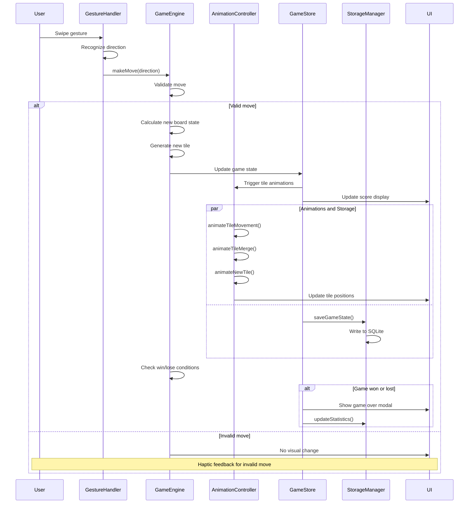
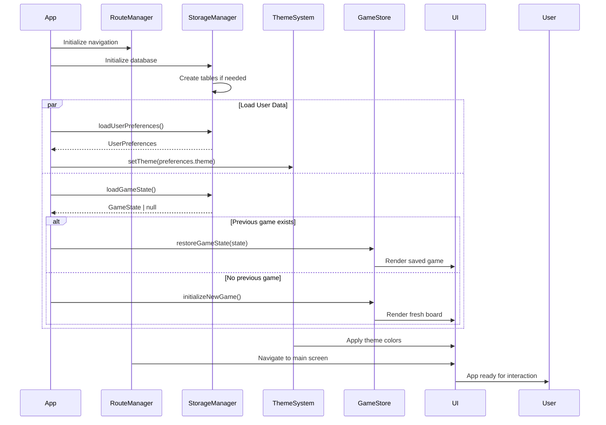
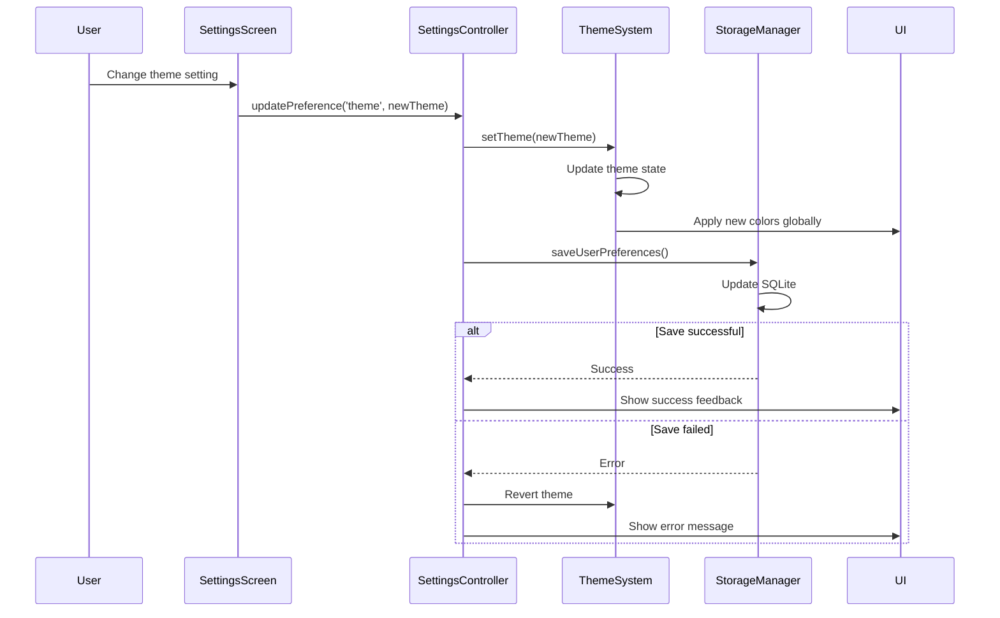
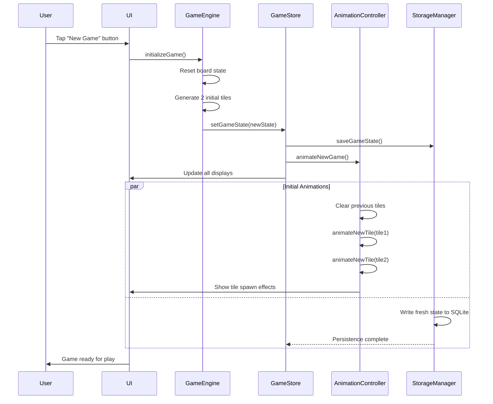

# Core Workflows

## Game Move Execution Workflow

This sequence diagram illustrates the complete flow when a user makes a swipe gesture to move tiles on the game board.

## Application Startup and Game Loading Workflow

This diagram shows the initialization sequence when the app launches and restores previous game state.

## Settings Update and Persistence Workflow

This sequence demonstrates how user preference changes are handled and persisted across the application.

## New Game Initialization Workflow

This diagram shows the process of starting a new game, including state cleanup and initial tile placement.

