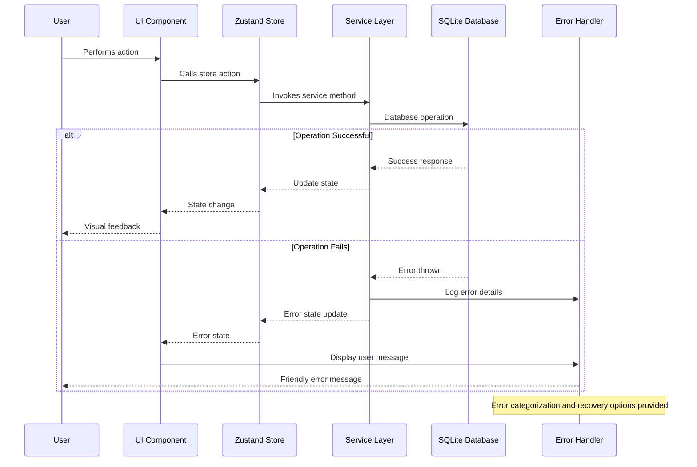

# Error Handling Strategy

## Unified Error Handling

The application implements a consistent error handling strategy across all layers, from game logic to user interface, ensuring graceful degradation and meaningful user feedback.

## Error Flow



## Error Response Format

All errors in the application follow a consistent format for predictable handling and user feedback.

```typescript
interface AppError {
  error: {
    code: string;
    message: string;
    details?: Record<string, any>;
    timestamp: string;
    requestId: string;
    category: ErrorCategory;
    severity: ErrorSeverity;
    recoverable: boolean;
  };
}

type ErrorCategory = 'GAME_LOGIC' | 'STORAGE' | 'ANIMATION' | 'NAVIGATION' | 'VALIDATION' | 'PERFORMANCE' | 'UNKNOWN';

type ErrorSeverity = 'LOW' | 'MEDIUM' | 'HIGH' | 'CRITICAL';

// Standard error codes
const ERROR_CODES = {
  // Game Logic Errors
  INVALID_MOVE: 'GAME_001',
  BOARD_STATE_CORRUPT: 'GAME_002',
  SAVE_GAME_FAILED: 'GAME_003',

  // Storage Errors
  DATABASE_CONNECTION_FAILED: 'STORAGE_001',
  DATA_CORRUPTION: 'STORAGE_002',
  STORAGE_QUOTA_EXCEEDED: 'STORAGE_003',

  // Animation Errors
  ANIMATION_TIMEOUT: 'ANIM_001',
  REANIMATED_ERROR: 'ANIM_002',

  // Navigation Errors
  ROUTE_NOT_FOUND: 'NAV_001',
  NAVIGATION_STATE_INVALID: 'NAV_002',

  // Validation Errors
  INVALID_INPUT: 'VALID_001',
  TYPE_VALIDATION_FAILED: 'VALID_002',
} as const;
```

## Frontend Error Handling

Client-side error handling with user-friendly messaging and recovery options.

```typescript
// Global error handler service
class ErrorHandler {
  private static instance: ErrorHandler;
  private errorQueue: AppError[] = [];
  private maxQueueSize = 50;

  static getInstance(): ErrorHandler {
    if (!ErrorHandler.instance) {
      ErrorHandler.instance = new ErrorHandler();
    }
    return ErrorHandler.instance;
  }

  handleError(error: unknown, context?: string): AppError {
    const appError = this.normalizeError(error, context);

    // Log error for debugging
    this.logError(appError);

    // Add to error queue for potential batch processing
    this.addToQueue(appError);

    // Show user notification if appropriate
    this.showUserNotification(appError);

    return appError;
  }

  private normalizeError(error: unknown, context?: string): AppError {
    const timestamp = new Date().toISOString();
    const requestId = this.generateRequestId();

    if (error instanceof Error) {
      return {
        error: {
          code: this.getErrorCode(error),
          message: error.message,
          details: {
            stack: error.stack,
            context,
            name: error.name,
          },
          timestamp,
          requestId,
          category: this.categorizeError(error),
          severity: this.getSeverity(error),
          recoverable: this.isRecoverable(error),
        },
      };
    }

    // Handle non-Error objects
    return {
      error: {
        code: ERROR_CODES.UNKNOWN,
        message: String(error) || 'Unknown error occurred',
        details: { context, originalError: error },
        timestamp,
        requestId,
        category: 'UNKNOWN',
        severity: 'MEDIUM',
        recoverable: true,
      },
    };
  }

  private showUserNotification(appError: AppError): void {
    const { category, severity, recoverable } = appError.error;

    // Don't show low severity or internal errors to users
    if (severity === 'LOW' || category === 'PERFORMANCE') {
      return;
    }

    const userMessage = this.getUserFriendlyMessage(appError);
    const actions = recoverable ? this.getRecoveryActions(appError) : [];

    // Show toast notification or modal based on severity
    if (severity === 'CRITICAL') {
      this.showErrorModal(userMessage, actions);
    } else {
      this.showToast(userMessage, severity);
    }
  }

  private getUserFriendlyMessage(appError: AppError): string {
    const { code } = appError.error;

    const messageMap: Record<string, string> = {
      [ERROR_CODES.SAVE_GAME_FAILED]:
        'Unable to save your game progress. Please try again.',
      [ERROR_CODES.DATABASE_CONNECTION_FAILED]:
        'Unable to access game data. Please restart the app.',
      [ERROR_CODES.INVALID_MOVE]: 'That move is not allowed right now.',
      [ERROR_CODES.ANIMATION_TIMEOUT]:
        'Game animation froze. Refreshing the game board.',
      [ERROR_CODES.STORAGE_QUOTA_EXCEEDED]:
        'Device storage is full. Please free up space.',
    };

    return messageMap[code] || 'Something went wrong. Please try again.';
  }

  private getRecoveryActions(appError: AppError): RecoveryAction[] {
    const { code } = appError.error;

    const actionMap: Record<string, RecoveryAction[]> = {
      [ERROR_CODES.SAVE_GAME_FAILED]: [
        { label: 'Retry Save', action: () => this.retrySave() },
        { label: 'Continue Without Saving', action: () => this.continueGame() },
      ],
      [ERROR_CODES.DATABASE_CONNECTION_FAILED]: [
        { label: 'Restart App', action: () => this.restartApp() },
        { label: 'Clear Data', action: () => this.clearAppData() },
      ],
      [ERROR_CODES.ANIMATION_TIMEOUT]: [
        { label: 'Refresh Board', action: () => this.refreshGameBoard() },
      ],
    };

    return (
      actionMap[code] || [{ label: 'Retry', action: () => this.genericRetry() }]
    );
  }
}

interface RecoveryAction {
  label: string;
  action: () => void;
  destructive?: boolean;
}

// React error boundary for component-level error handling
class GameErrorBoundary extends React.Component<
  { children: React.ReactNode },
  { hasError: boolean; error?: AppError }
> {
  constructor(props: any) {
    super(props);
    this.state = { hasError: false };
  }

  static getDerivedStateFromError(error: Error): {
    hasError: boolean;
    error: AppError;
  } {
    const errorHandler = ErrorHandler.getInstance();
    const appError = errorHandler.handleError(error, 'React Error Boundary');

    return {
      hasError: true,
      error: appError,
    };
  }

  componentDidCatch(error: Error, errorInfo: React.ErrorInfo) {
    console.error('React Error Boundary caught error:', error, errorInfo);
  }

  handleRetry = () => {
    this.setState({ hasError: false, error: undefined });
  };

  render() {
    if (this.state.hasError) {
      return (
        <ErrorFallback error={this.state.error} onRetry={this.handleRetry} />
      );
    }

    return this.props.children;
  }
}

// Error fallback component
function ErrorFallback({
  error,
  onRetry,
}: {
  error?: AppError;
  onRetry: () => void;
}) {
  return (
    <View style={styles.errorContainer}>
      <Text style={styles.errorTitle}>Oops! Something went wrong</Text>
      <Text style={styles.errorMessage}>
        {error?.error.message || 'An unexpected error occurred'}
      </Text>
      <Button title="Try Again" onPress={onRetry} />
      <Button
        title="Restart Game"
        onPress={() => {
          // Reset game state and retry
          const gameStore = useGameStore.getState();
          gameStore.newGame();
          onRetry();
        }}
        variant="secondary"
      />
    </View>
  );
}
```

## Service Layer Error Handling

Comprehensive error handling in business logic and data access layers.

```typescript
// Storage service with robust error handling
class StorageService {
  private db: SQLiteDatabase;
  private errorHandler = ErrorHandler.getInstance();

  async saveGameState(gameState: GameState): Promise<void> {
    try {
      // Validate input data
      if (!this.validateGameState(gameState)) {
        throw new ValidationError('Invalid game state format');
      }

      // Attempt to save with retry logic
      await this.executeWithRetry(async () => {
        await this.db.runAsync(
          'UPDATE game_states SET board_data = ?, score = ?, updated_at = ? WHERE is_current = TRUE',
          [JSON.stringify(gameState.board), gameState.score, Date.now()]
        );
      });
    } catch (error) {
      // Categorize and handle the error
      if (error instanceof ValidationError) {
        throw this.errorHandler.handleError(error, 'saveGameState validation');
      } else if (error instanceof SQLiteError) {
        throw this.errorHandler.handleError(error, 'saveGameState database');
      } else {
        throw this.errorHandler.handleError(error, 'saveGameState unknown');
      }
    }
  }

  async loadGameState(): Promise<GameState | null> {
    try {
      const result = await this.executeWithRetry(async () => {
        return await this.db.getFirstAsync<any>(
          'SELECT board_data, score, best_score FROM game_states WHERE is_current = TRUE'
        );
      });

      if (!result) {
        return null;
      }

      // Validate loaded data
      const gameState = this.parseGameState(result);
      if (!this.validateGameState(gameState)) {
        throw new DataCorruptionError('Loaded game state is corrupted');
      }

      return gameState;
    } catch (error) {
      if (error instanceof DataCorruptionError) {
        // Attempt data recovery
        console.warn('Game state corrupted, attempting recovery...');
        return this.recoverGameState();
      } else {
        this.errorHandler.handleError(error, 'loadGameState');
        return null; // Graceful fallback
      }
    }
  }

  private async executeWithRetry<T>(
    operation: () => Promise<T>,
    maxRetries: number = 3,
    delay: number = 100
  ): Promise<T> {
    let lastError: Error;

    for (let attempt = 1; attempt <= maxRetries; attempt++) {
      try {
        return await operation();
      } catch (error) {
        lastError = error as Error;

        if (attempt === maxRetries) {
          break;
        }

        // Wait before retrying with exponential backoff
        await new Promise((resolve) => setTimeout(resolve, delay * Math.pow(2, attempt - 1)));
      }
    }

    throw lastError!;
  }

  private async recoverGameState(): Promise<GameState | null> {
    try {
      // Attempt to load from backup or create fresh state
      const backupState = await this.loadBackupGameState();
      if (backupState && this.validateGameState(backupState)) {
        return backupState;
      }

      // Create fresh game state as last resort
      console.info('Creating fresh game state after recovery failure');
      return this.createFreshGameState();
    } catch (error) {
      this.errorHandler.handleError(error, 'recoverGameState');
      return null;
    }
  }
}

// Custom error classes
class ValidationError extends Error {
  constructor(message: string) {
    super(message);
    this.name = 'ValidationError';
  }
}

class DataCorruptionError extends Error {
  constructor(message: string) {
    super(message);
    this.name = 'DataCorruptionError';
  }
}

// Game engine error handling
class GameEngine {
  private errorHandler = ErrorHandler.getInstance();

  makeMove(board: Board, direction: Direction): MoveResult {
    try {
      // Validate inputs
      if (!this.validateBoard(board)) {
        throw new ValidationError('Invalid board state');
      }

      if (!this.isValidDirection(direction)) {
        throw new ValidationError('Invalid move direction');
      }

      // Execute move logic
      const result = this.processMove(board, direction);

      // Validate result
      if (!this.validateMoveResult(result)) {
        throw new Error('Move resulted in invalid state');
      }

      return result;
    } catch (error) {
      // Handle and transform error
      const appError = this.errorHandler.handleError(error, 'makeMove');

      // Return safe fallback result
      return {
        board,
        moved: false,
        score: 0,
        mergedTiles: [],
        newTile: null,
        gameOver: false,
      };
    }
  }

  private validateBoard(board: Board): boolean {
    if (!Array.isArray(board) || board.length !== 4) {
      return false;
    }

    return board.every(
      (row) => Array.isArray(row) && row.length === 4 && row.every((tile) => tile === null || this.validateTile(tile))
    );
  }

  private validateTile(tile: Tile): boolean {
    return (
      typeof tile.id === 'string' &&
      typeof tile.value === 'number' &&
      tile.value > 0 &&
      (tile.value & (tile.value - 1)) === 0 && // Power of 2
      typeof tile.row === 'number' &&
      typeof tile.col === 'number' &&
      tile.row >= 0 &&
      tile.row < 4 &&
      tile.col >= 0 &&
      tile.col < 4
    );
  }
}
```
