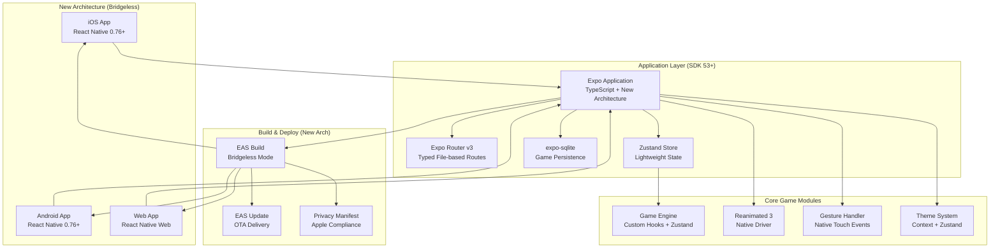

# High Level Architecture

## Technical Summary

Test 2048 is built as a client-side React Native application using Expo SDK 53+ with the New Architecture enabled, targeting iOS, Android, and web platforms through a single codebase. The architecture leverages Zustand for lightweight state management, expo-sqlite for performant game data persistence, and Expo Router v3 for type-safe file-based navigation. All game logic runs client-side with no backend dependencies, using React Native Reanimated 3 for 60fps animations and React Native Gesture Handler for platform-optimized touch interactions. The application deploys through EAS Build with the New Architecture's bridgeless mode for enhanced performance and future compatibility.

## Platform and Infrastructure Choice

**Platform:** Expo SDK 53+ with New Architecture enabled
**Key Services:** EAS Build (bridgeless mode), EAS Update (OTA), expo-sqlite (game persistence), Expo Router v3 (typed navigation), React Native Reanimated 3 (animations)
**Deployment Host and Regions:** iOS App Store (global), Google Play Store (global), Vercel (web hosting with global CDN)

## Repository Structure

**Structure:** Single Expo application with modular architecture
**Monorepo Tool:** N/A - Clean single package structure following Expo Router conventions
**Package Organization:** File-based routing structure with feature-based component organization

## High Level Architecture Diagram

## Architectural Patterns

- **New Architecture Pattern:** React Native's New Architecture with bridgeless mode enabled - _Rationale:_ Future-proofs the app for 2025+ when legacy architecture is removed, provides better performance
- **Zustand State Management:** Lightweight store for game state without boilerplate - _Rationale:_ Perfect middle ground between Context API and Redux for game complexity, better performance than Context
- **File-Based Routing with TypeScript:** Expo Router v3 with automatically generated typed routes - _Rationale:_ Type-safe navigation prevents runtime errors, clean file structure, automatic deep linking
- **SQLite for Game Data:** expo-sqlite for structured game state and statistics - _Rationale:_ Better performance than AsyncStorage for game data, supports transactions and complex queries
- **Custom Hooks + Zustand Hybrid:** Game logic in hooks that interface with Zustand store - _Rationale:_ Combines React hooks benefits with performant global state management
- **Component-Based Architecture:** Feature-based component organization following Expo conventions - _Rationale:_ Scalable structure that aligns with Expo Router's file-based routing
- **Native Driver Animations:** React Native Reanimated 3 with native driver for all animations - _Rationale:_ Ensures 60fps performance by running animations on UI thread
